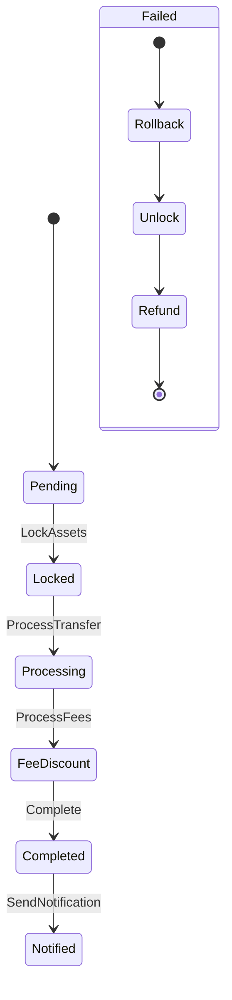

# Core Settlement Service - Design Document

## 1. Tổng quan

### 1.1. Mục tiêu
Core Settlement Service là một microservice chịu trách nhiệm xử lý các giao dịch khớp lệnh từ hệ thống trading, đảm bảo việc chuyển giao tài sản giữa người mua và người bán được thực hiện an toàn và chính xác.

### 1.2. Vai trò trong hệ thống
- Nhận kết quả khớp lệnh từ Matching Engine
- Quản lý quy trình settlement theo state machine
- Tương tác với các service khác để hoàn tất giao dịch
- Đảm bảo tính nhất quán và độ tin cậy của dữ liệu
- **Gửi thông báo hoàn thành settlement đến các hệ thống khác**

## 2. Kiến trúc

### 2.1. Sơ đồ tổng thể
```
[Matching Engine] → [Kafka] → [Settlement Service] → [External Services]
                           ↓                              ↓
                    [State Machine]                [Settlement Producer]
                           ↓                              ↓
        ┌─────────┬─────┴─────┬─────────┐         [Kafka Topics]
        ↓         ↓           ↓         ↓
    [Asset]    [Wallet]     [Fee]    [Ledger]
    Service    Service     Service    Service
```

### 2.2. Các thành phần chính

#### 2.2.1. TradeMatchConsumer
- Nhận messages từ Kafka
- Validate và deserialize dữ liệu
- Tạo settlement transaction
- Điều phối quy trình xử lý

#### 2.2.2. State Machine Core
- Quản lý trạng thái và chuyển đổi
- Xử lý business logic
- Retry và error handling

#### 2.2.3. SettlementService
- Xử lý các tương tác với external services
- Quản lý rollback khi có lỗi
- Ghi log và metrics

#### 2.2.4. SettlementProducer
- Gửi thông báo hoàn thành settlement
- Gửi thông báo lỗi settlement
- Gửi thông báo rollback settlement

## 3. State Machine Design

### 3.1. States


### 3.2. Chi tiết các state

#### 3.2.1. Pending
- **Mục tiêu**: Khởi tạo transaction
- **Input**: TradeMatch từ Kafka
- **Output**: SettlementTransaction mới
- **Validation**:
  - Kiểm tra tradeId không trùng lặp
  - Validate dữ liệu đầu vào
  - Tạo idempotency key

#### 3.2.2. Locked
- **Mục tiêu**: Khóa tài sản
- **Input**: SettlementTransaction
- **Output**: Updated transaction
- **Operations**:
  - Lock buyer assets
  - Lock seller assets
  - Rollback nếu có lỗi

#### 3.2.3. Processing
- **Mục tiêu**: Chuyển tài sản
- **Input**: SettlementTransaction
- **Output**: Updated transaction
- **Operations**:
  - Transfer assets
  - Update balances
  - Handle failures

#### 3.2.4. FeeDiscount
- **Mục tiêu**: Xử lý phí
- **Input**: SettlementTransaction
- **Output**: Updated transaction
- **Operations**:
  - Calculate fees
  - Apply maker/taker rates
  - Process fee deductions

#### 3.2.5. Completed
- **Mục tiêu**: Hoàn tất giao dịch
- **Input**: SettlementTransaction
- **Output**: Final state
- **Operations**:
  - Record in ledger
  - Unlock remaining assets
  - Send notifications

#### 3.2.6. Notified
- **Mục tiêu**: Gửi thông báo hoàn thành
- **Input**: Completed SettlementTransaction
- **Output**: Notification sent
- **Operations**:
  - Send settlement completed message
  - Send balance update message
  - Send fee processed message

## 4. Data Models

### 4.1. TradeMatch
```csharp
public class TradeMatch
{
    public string TradeId { get; set; }
    public string BuyerId { get; set; }
    public string SellerId { get; set; }
    public string Symbol { get; set; }
    public decimal Price { get; set; }
    public decimal Quantity { get; set; }
    public DateTime Timestamp { get; set; }
    public string MakerSide { get; set; }
}
```

### 4.2. SettlementTransaction
```csharp
public class SettlementTransaction
{
    public string Id { get; set; }
    public string TradeId { get; set; }
    public SettlementState State { get; set; }
    public DateTime CreatedAt { get; set; }
    public DateTime? UpdatedAt { get; set; }
    public string ErrorMessage { get; set; }
    public int RetryCount { get; set; }
    public string IdempotencyKey { get; set; }
    
    // Trade details
    public string BuyerId { get; set; }
    public string SellerId { get; set; }
    public string Symbol { get; set; }
    public decimal Price { get; set; }
    public decimal Quantity { get; set; }
    public string MakerSide { get; set; }
    
    // Settlement details
    public decimal BuyerFee { get; set; }
    public decimal SellerFee { get; set; }
    public bool IsBuyerLocked { get; set; }
    public bool IsSellerLocked { get; set; }
    public bool IsTransferCompleted { get; set; }
    public bool IsFeeProcessed { get; set; }
}
```

### 4.3. SettlementCompletedMessage
```csharp
public class SettlementCompletedMessage
{
    public string TradeId { get; set; }
    public string SettlementId { get; set; }
    public string BuyerId { get; set; }
    public string SellerId { get; set; }
    public string Symbol { get; set; }
    public decimal Price { get; set; }
    public decimal Quantity { get; set; }
    public decimal BuyerFee { get; set; }
    public decimal SellerFee { get; set; }
    public DateTime CompletedAt { get; set; }
    public string MakerSide { get; set; }
}
```

### 4.4. BalanceUpdateMessage
```csharp
public class BalanceUpdateMessage
{
    public string UserId { get; set; }
    public string Symbol { get; set; }
    public decimal Balance { get; set; }
    public decimal LockedBalance { get; set; }
    public DateTime UpdatedAt { get; set; }
    public string TradeId { get; set; }
}
```

### 4.5. SettlementFailedMessage
```csharp
public class SettlementFailedMessage
{
    public string TradeId { get; set; }
    public string SettlementId { get; set; }
    public string ErrorMessage { get; set; }
    public SettlementState FailedAtState { get; set; }
    public DateTime FailedAt { get; set; }
    public int RetryCount { get; set; }
}
```

## 5. External Service Integration

### 5.1. Asset Service
```csharp
public interface IAssetService
{
    Task<bool> LockAssetsAsync(string userId, string symbol, decimal amount);
    Task<bool> UnlockAssetsAsync(string userId, string symbol, decimal amount);
    Task<decimal> GetBalanceAsync(string userId, string symbol);
}
```

### 5.2. Wallet Service
```csharp
public interface IWalletService
{
    Task<bool> TransferAsync(string fromUserId, string toUserId, string symbol, decimal amount);
    Task<bool> DeductFeeAsync(string userId, string symbol, decimal fee);
    Task<bool> RefundFeeAsync(string userId, string symbol, decimal fee);
}
```

### 5.3. Fee Service
```csharp
public interface IFeeService
{
    Task<(decimal buyerFee, decimal sellerFee)> CalculateFeesAsync(
        string symbol,
        decimal price,
        decimal quantity,
        string makerSide);
}
```

### 5.4. Ledger Service
```csharp
public interface ILedgerService
{
    Task<bool> RecordTransactionAsync(SettlementTransaction transaction);
    Task<SettlementTransaction> GetTransactionAsync(string tradeId);
}
```

## 6. Kafka Producer Integration

### 6.1. SettlementProducer
```csharp
public interface ISettlementProducer
{
    Task PublishSettlementCompletedAsync(SettlementCompletedMessage message);
    Task PublishBalanceUpdateAsync(BalanceUpdateMessage message);
    Task PublishSettlementFailedAsync(SettlementFailedMessage message);
    Task PublishFeeProcessedAsync(FeeProcessedMessage message);
}

public class SettlementProducer : ISettlementProducer
{
    private readonly IProducer<string, string> _producer;
    private readonly ILogger<SettlementProducer> _logger;
    private readonly string _settlementCompletedTopic;
    private readonly string _balanceUpdateTopic;
    private readonly string _settlementFailedTopic;
    private readonly string _feeProcessedTopic;

    public async Task PublishSettlementCompletedAsync(SettlementCompletedMessage message)
    {
        try
        {
            var json = JsonSerializer.Serialize(message);
            var result = await _producer.ProduceAsync(_settlementCompletedTopic, 
                new Message<string, string> { Key = message.TradeId, Value = json });
            
            _logger.LogInformation(
                "Published settlement completed message for trade {TradeId} to partition {Partition}", 
                message.TradeId, 
                result.Partition);
        }
        catch (Exception ex)
        {
            _logger.LogError(ex, 
                "Failed to publish settlement completed message for trade {TradeId}", 
                message.TradeId);
            throw;
        }
    }

    public async Task PublishBalanceUpdateAsync(BalanceUpdateMessage message)
    {
        try
        {
            var json = JsonSerializer.Serialize(message);
            var result = await _producer.ProduceAsync(_balanceUpdateTopic, 
                new Message<string, string> { Key = message.UserId, Value = json });
            
            _logger.LogInformation(
                "Published balance update message for user {UserId} to partition {Partition}", 
                message.UserId, 
                result.Partition);
        }
        catch (Exception ex)
        {
            _logger.LogError(ex, 
                "Failed to publish balance update message for user {UserId}", 
                message.UserId);
            throw;
        }
    }

    public async Task PublishSettlementFailedAsync(SettlementFailedMessage message)
    {
        try
        {
            var json = JsonSerializer.Serialize(message);
            var result = await _producer.ProduceAsync(_settlementFailedTopic, 
                new Message<string, string> { Key = message.TradeId, Value = json });
            
            _logger.LogInformation(
                "Published settlement failed message for trade {TradeId} to partition {Partition}", 
                message.TradeId, 
                result.Partition);
        }
        catch (Exception ex)
        {
            _logger.LogError(ex, 
                "Failed to publish settlement failed message for trade {TradeId}", 
                message.TradeId);
            throw;
        }
    }
}
```

### 6.2. Kafka Topics
```json
{
  "Kafka": {
    "Topics": {
      "SettlementCompleted": "settlement.completed",
      "BalanceUpdate": "balance.update",
      "SettlementFailed": "settlement.failed",
      "FeeProcessed": "fee.processed"
    },
    "Producer": {
      "BootstrapServers": "localhost:9092",
      "Acks": "all",
      "EnableIdempotence": true,
      "MaxInFlight": 5,
      "RetryBackoffMs": 1000,
      "RequestTimeoutMs": 30000
    }
  }
}
```

## 7. Error Handling

### 7.1. Retry Policy
```csharp
var retryPolicy = Policy
    .Handle<Exception>()
    .WaitAndRetryAsync(3, retryAttempt => 
        TimeSpan.FromSeconds(Math.Pow(2, retryAttempt)));
```

### 7.2. Circuit Breaker
```csharp
var circuitBreakerPolicy = Policy
    .Handle<Exception>()
    .CircuitBreakerAsync(
        exceptionsAllowedBeforeBreaking: 2,
        durationOfBreak: TimeSpan.FromSeconds(30));
```

### 7.3. Rollback Strategy
1. Unlock assets
2. Reverse transfers
3. Refund fees
4. Update transaction state
5. Log rollback details

## 8. Monitoring và Logging

### 8.1. Metrics
- Processing time per state
- Success/failure rates
- Queue length
- Error counts
- External service latency
- **Kafka producer metrics**
- **Message delivery success/failure rates**

### 8.2. Logging
- Structured logging với correlation ID
- Log levels: Information, Warning, Error
- Audit trail cho mỗi state transition
- **Kafka message publishing logs**

### 8.3. Health Checks
- Kafka connectivity
- Redis connectivity
- External service health
- System resources
- **Kafka producer health**

## 9. Performance Considerations

### 9.1. Optimization
- Async/await cho I/O operations
- Connection pooling
- Batch processing
- Caching với Redis
- **Kafka producer batching**

### 9.2. Scaling
- Horizontal scaling
- Partitioning theo symbol
- Load balancing
- Resource monitoring
- **Kafka topic partitioning**

## 10. Security

### 10.1. Authentication
- Service-to-service authentication
- API key management
- JWT validation
- **Kafka SASL authentication**

### 10.2. Authorization
- Role-based access control
- Permission validation
- Audit logging
- **Kafka ACLs**

### 10.3. Data Protection
- Encrypt sensitive data
- Secure communication
- Regular security audits
- **Kafka message encryption**

## 11. Testing Strategy

### 11.1. Unit Tests
- State machine transitions
- Business logic
- Error handling
- Retry mechanisms
- **Kafka producer tests**

### 11.2. Integration Tests
- External service integration
- End-to-end flows
- Error scenarios
- Performance testing
- **Kafka integration tests**

### 11.3. Load Tests
- Concurrent transactions
- System limits
- Recovery scenarios
- Performance benchmarks
- **Kafka producer load tests**

## 12. Deployment

### 12.1. Requirements
- .NET 8.0
- Kafka cluster
- Redis server
- External services
- **Kafka producer configuration**

### 12.2. Configuration
- Environment variables
- App settings
- Service endpoints
- Security settings
- **Kafka topic configuration**

### 12.3. Monitoring
- Health checks
- Metrics collection
- Log aggregation
- Alert configuration
- **Kafka monitoring**

## 13. Maintenance

### 13.1. Regular Tasks
- Log rotation
- Metrics analysis
- Performance tuning
- Security updates
- **Kafka topic maintenance**

### 13.2. Backup Strategy
- Transaction logs
- Configuration backup
- State machine snapshots
- Recovery procedures
- **Kafka message backup**

### 13.3. Update Procedures
- Version control
- Deployment process
- Rollback plan
- Testing requirements
- **Kafka schema evolution** 