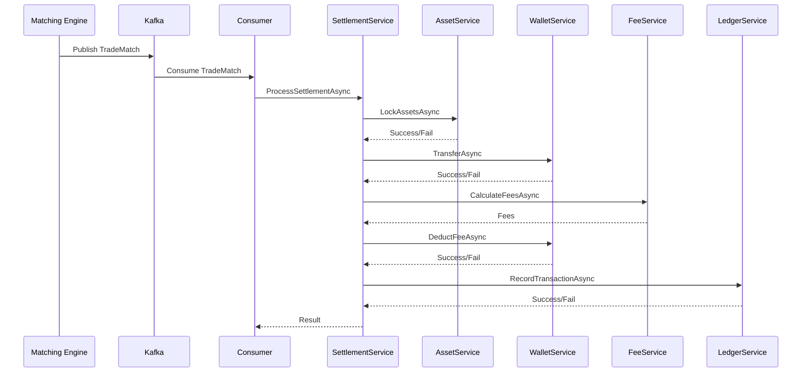
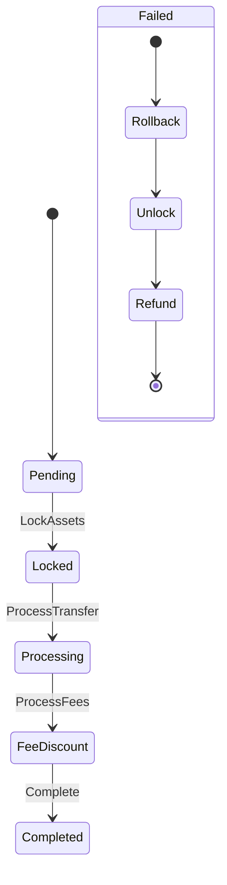

# Core Settlement Service - Design Document v2

## 1. Tổng quan

### 1.1. Mục tiêu
Core Settlement Service là một microservice chịu trách nhiệm xử lý các giao dịch khớp lệnh từ hệ thống trading, đảm bảo việc chuyển giao tài sản giữa người mua và người bán được thực hiện an toàn và chính xác.

### 1.2. Vai trò trong hệ thống
- Nhận kết quả khớp lệnh từ Matching Engine
- Quản lý quy trình settlement theo state machine
- Tương tác với các service khác để hoàn tất giao dịch
- Đảm bảo tính nhất quán và độ tin cậy của dữ liệu

## 2. Kiến trúc

### 2.1. Sơ đồ tổng thể
```
[Matching Engine] → [Kafka] → [Settlement Service] → [External Services]
                           ↓
                    [State Machine]
                           ↓
        ┌─────────┬─────┴─────┬─────────┐
        ↓         ↓           ↓         ↓
    [Asset]    [Wallet]     [Fee]    [Ledger]
    Service    Service     Service    Service
```

### 2.2. Các thành phần chính

#### 2.2.1. TradeMatchConsumer
- Nhận messages từ Kafka
- Validate và deserialize dữ liệu
- Tạo settlement transaction
- Gọi SettlementService để xử lý

#### 2.2.2. SettlementService
- Quản lý toàn bộ quy trình settlement
- Tương tác với external services
- Quản lý state và rollback
- Xử lý lỗi và retry

#### 2.2.3. External Services
- AssetService: Quản lý tài sản và lock/unlock
- WalletService: Xử lý chuyển khoản và phí
- FeeService: Tính toán phí giao dịch
- LedgerService: Ghi nhận giao dịch

## 3. Luồng xử lý

### 3.1. Sequence Diagram


### 3.2. States và Transitions


## 4. Data Models

### 4.1. TradeMatch
```csharp
public class TradeMatch
{
    public string TradeId { get; set; }
    public string BuyerId { get; set; }
    public string SellerId { get; set; }
    public string Symbol { get; set; }
    public decimal Price { get; set; }
    public decimal Quantity { get; set; }
    public DateTime Timestamp { get; set; }
    public string MakerSide { get; set; }
}
```

### 4.2. SettlementTransaction
```csharp
public class SettlementTransaction
{
    public string Id { get; set; }
    public string TradeId { get; set; }
    public SettlementState State { get; set; }
    public DateTime CreatedAt { get; set; }
    public DateTime? UpdatedAt { get; set; }
    public string ErrorMessage { get; set; }
    public int RetryCount { get; set; }
    public string IdempotencyKey { get; set; }
    
    // Trade details
    public string BuyerId { get; set; }
    public string SellerId { get; set; }
    public string Symbol { get; set; }
    public decimal Price { get; set; }
    public decimal Quantity { get; set; }
    public string MakerSide { get; set; }
    
    // Settlement details
    public decimal BuyerFee { get; set; }
    public decimal SellerFee { get; set; }
    public bool IsBuyerLocked { get; set; }
    public bool IsSellerLocked { get; set; }
    public bool IsTransferCompleted { get; set; }
    public bool IsFeeProcessed { get; set; }
}
```

## 5. Error Handling

### 5.1. Retry Policy
```csharp
var retryPolicy = Policy
    .Handle<Exception>()
    .WaitAndRetryAsync(3, retryAttempt => 
        TimeSpan.FromSeconds(Math.Pow(2, retryAttempt)));
```

### 5.2. Circuit Breaker
```csharp
var circuitBreakerPolicy = Policy
    .Handle<Exception>()
    .CircuitBreakerAsync(
        exceptionsAllowedBeforeBreaking: 2,
        durationOfBreak: TimeSpan.FromSeconds(30));
```

### 5.3. Rollback Strategy
1. Unlock assets
2. Reverse transfers
3. Refund fees
4. Update transaction state
5. Log rollback details

## 6. Monitoring và Logging

### 6.1. Metrics
- Processing time per state
- Success/failure rates
- Queue length
- Error counts
- External service latency

### 6.2. Logging
- Structured logging với correlation ID
- Log levels: Information, Warning, Error
- Audit trail cho mỗi state transition

### 6.3. Health Checks
- Kafka connectivity
- Redis connectivity
- External service health
- System resources

## 7. Performance Considerations

### 7.1. Optimization
- Async/await cho I/O operations
- Connection pooling
- Batch processing
- Caching với Redis

### 7.2. Scaling
- Horizontal scaling
- Partitioning theo symbol
- Load balancing
- Resource monitoring

## 8. Security

### 8.1. Authentication
- Service-to-service authentication
- API key management
- JWT validation

### 8.2. Authorization
- Role-based access control
- Permission validation
- Audit logging

### 8.3. Data Protection
- Encrypt sensitive data
- Secure communication
- Regular security audits

## 9. Testing Strategy

### 9.1. Unit Tests
- State machine transitions
- Business logic
- Error handling
- Retry mechanisms

### 9.2. Integration Tests
- External service integration
- End-to-end flows
- Error scenarios
- Performance testing

### 9.3. Load Tests
- Concurrent transactions
- System limits
- Recovery scenarios
- Performance benchmarks

## 10. Deployment

### 10.1. Requirements
- .NET 8.0
- Kafka cluster
- Redis server
- External services

### 10.2. Configuration
- Environment variables
- App settings
- Service endpoints
- Security settings

### 10.3. Monitoring
- Health checks
- Metrics collection
- Log aggregation
- Alert configuration

## 11. Maintenance

### 11.1. Regular Tasks
- Log rotation
- Metrics analysis
- Performance tuning
- Security updates

### 11.2. Backup Strategy
- Transaction logs
- Configuration backup
- State machine snapshots
- Recovery procedures

### 11.3. Update Procedures
- Version control
- Deployment process
- Rollback plan
- Testing requirements 